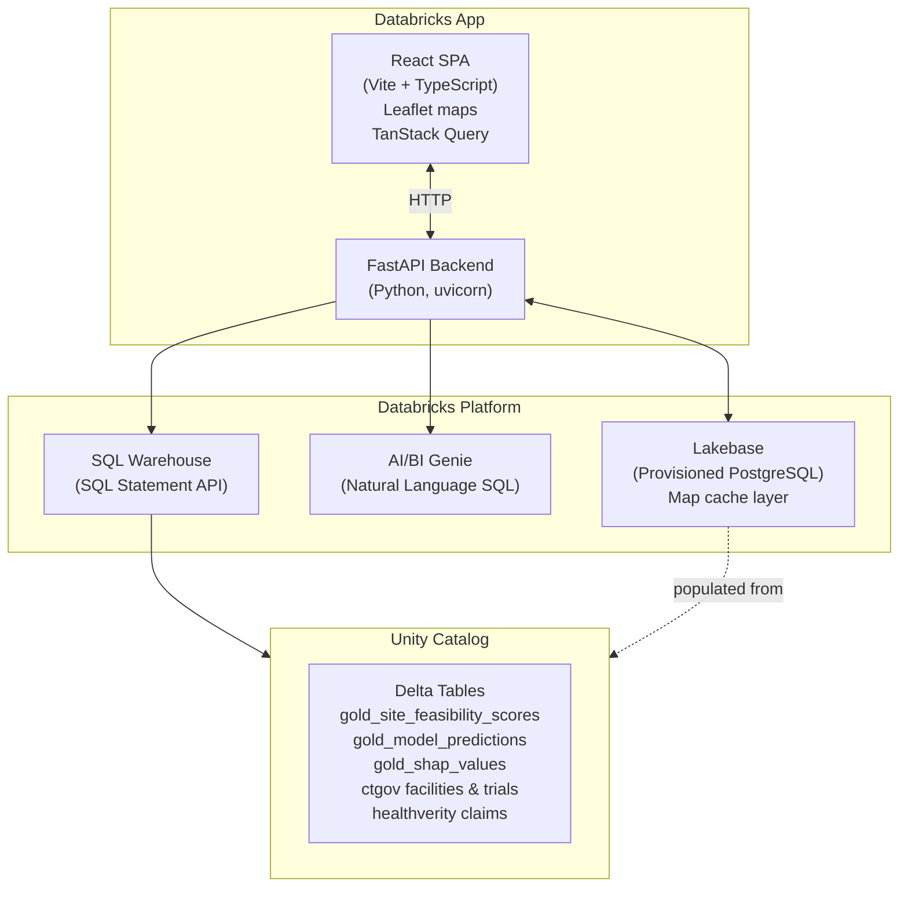

# Clinical Trial Site Feasibility Workbench

> **This is a Databricks Solution Accelerator** — a starting point to accelerate your clinical operations site selection workflow on the Databricks platform. You are welcome to use, extend, and adapt this accelerator within the terms of the [DB License](LICENSE.md).

A Databricks App for clinical trial site selection and feasibility analysis. Helps clinical operations teams select, score, and shortlist investigator sites using ML-powered composite scoring, real-world evidence (RWE) patient access data, and AI/BI Genie natural language queries.


## Features

- **6-step feasibility wizard** — Protocol selection → constraints → geographic map → site ranking → deep dive → final shortlist
- **Composite site scoring** across 4 ML-powered dimensions: RWE Patient Access (35%), Operational Performance (30%), Site Readiness & SSQ (20%), Protocol Execution (15%)
- **Interactive world map** of ClinicalTrials.gov active trial sites with indication filtering and RWE patient population overlay
- **Protocol-level site map** — your CTMS sites (state-centroid positioned), patient density, competitor trial overlay
- **Site deep dive** — feature contribution waterfall charts per scoring dimension
- **AI/BI Genie assistant** — natural language SQL queries against your feasibility data
- **Browse All Sites** — flat sortable table of all scored sites across all protocols with CSV export
- **Save/load assessments** — persist shortlists to Lakebase for team sharing
- **Export to CSV** — download your final shortlist

## Architecture

<details>
<summary>Show architecture diagram</summary>



</details>

## Prerequisites

| Tool | Min Version | Purpose |
|------|-------------|---------|
| Databricks workspace | Any (AWS/Azure/GCP) | Platform runtime |
| Unity Catalog | Enabled | Data storage for all Delta tables |
| Databricks SQL Warehouse | Any | SQL Statement API queries |
| Databricks CLI | 0.220+ | Deployment (`databricks apps deploy`) |
| Python | 3.10+ | Backend runtime |
| Node.js | 18+ | Frontend build (`npm run build`) |
| Lakebase (Provisioned PostgreSQL) | Optional | Map/patient data cache layer; falls back to SQL API without it |
| AI/BI Genie space | Optional | Feasibility Assistant natural language queries; returns 503 if unconfigured |

### Required Unity Catalog tables

| Table key | Full path | Description |
|-----------|-----------|-------------|
| `ctgov_facilities` | `<catalog>.clinicaltrials_gov.facilities` | ClinicalTrials.gov facility locations |
| `ctgov_trials` | `<catalog>.ctgov_gold.trials` | Trial status (RECRUITING, etc.) |
| `ctgov_conditions` | `<catalog>.clinicaltrials_gov.conditions` | Trial indications |
| `feasibility_scores` | `<catalog>.ml_features.gold_site_feasibility_scores` | Composite feasibility scores |
| `model_predictions` | `<catalog>.ml_features.gold_model_predictions` | LightGBM enrollment velocity predictions |
| `shap_values` | `<catalog>.ml_features.gold_shap_values` | SHAP feature attribution per site |
| `dim_drivers` | `<catalog>.ml_features.gold_feasibility_dimension_drivers` | Score dimension drivers |
| `rwe_patient_access` | `<catalog>.ml_features.gold_rwe_patient_access` | RWE patient access by state/TA |
| `site_geo` | `<catalog>.ctms_data.ctms_site_geo` | Site geography (state, ZIP3, country) |
| `healthverity_claims` | `samples.healthverity.claims_sample_synthetic` | Patient population data (override via `HEALTHVERITY_TABLE`) |

## Quick Start

### 0. Seed your Unity Catalog tables

Upload `notebooks/00_seed_data.py` to your Databricks workspace and run it. Set the `catalog` widget to a catalog you own (e.g. `my_catalog`). This creates all 10 required Delta tables in under 10 minutes on any single-node cluster (DBR 13+).

Note the catalog name you used — you'll set it as `UC_CATALOG` below.

### 1. Clone and configure

```bash
git clone <repo-url>
cd public-site-workbench
cp .env.example .env
# Edit .env and fill in your values
```

### 2. Set required environment variables

| Variable | Required | Description |
|----------|----------|-------------|
| `DATABRICKS_WAREHOUSE_ID` | ✅ | SQL Warehouse ID (e.g. `abc123def456`) |
| `UC_CATALOG` | ✅ | Unity Catalog catalog name where your data lives |
| `GENIE_SPACE_ID` | Optional | AI/BI Genie space ID for the Feasibility Assistant |
| `HEALTHVERITY_TABLE` | Optional | Override patient data table (default: `samples.healthverity.claims_sample_synthetic`) |
| `DATABRICKS_PROFILE` | Local only | CLI profile name for local development (default: `DEFAULT`) |

### 3. Deploy to Databricks Apps

```bash
./deploy.sh
```

This script builds the React frontend, syncs all files to your Databricks workspace, and deploys the app via the Databricks CLI.

### Manual deployment

```bash
# Build frontend
cd frontend && npm install && npm run build && cd ..

# Sync to workspace
WORKSPACE_PATH="/Workspace/Users/<your-email>/public-site-workbench"
databricks sync . "$WORKSPACE_PATH" \
  --exclude ".venv" --exclude "node_modules" --exclude "__pycache__" \
  --exclude ".git" --exclude "frontend/src" --exclude "frontend/public" \
  --exclude "frontend/node_modules" --full --watch=false

# Deploy
databricks apps deploy public-site-workbench \
  --source-code-path "$WORKSPACE_PATH"
```

## Local Development

```bash
# Backend
pip install -e ".[dev]"
export DATABRICKS_PROFILE=DEFAULT
export DATABRICKS_WAREHOUSE_ID=<your-warehouse-id>
export UC_CATALOG=<your-catalog>
uvicorn app:app --reload --port 8000

# Frontend (separate terminal)
cd frontend
npm install
npm run dev   # Vite proxy forwards /api/* to localhost:8000
```

## Configuration

### `app.yaml`

Update these fields before deploying:

```yaml
env:
  - name: DATABRICKS_WAREHOUSE_ID
    value: "your-warehouse-id"
  - name: GENIE_SPACE_ID
    value: "your-genie-space-id"
  - name: UC_CATALOG
    value: "your-catalog-name"

resources:
  - name: "site-feasibility-lakebase"
    database:
      instance_name: "your-lakebase-instance-name"
      database_name: "your-database-name"
```

### Data Schema Requirements

The app expects these Unity Catalog tables. See `server/config.py` → `TABLES` dict for the full mapping.

**Feasibility scores** (`gold_site_feasibility_scores`):
```sql
site_id, study_id, model_ta_segment, country,
rwe_patient_access_score, operational_performance_score,
site_selection_score, site_selection_probability, ssq_status,
protocol_execution_score, composite_feasibility_score,
rwe_patient_count_state
```

**ML predictions** (`gold_model_predictions`):
```sql
site_id, study_id, predicted_next_month_rands, predicted_stall_prob, is_latest
```

**Site geography** (`ctms_site_geo`):
```sql
site_id, us_state, us_zip3, country
```

## Project Structure

```
public-site-workbench/
├── app.py                    # FastAPI entry point + /health endpoint
├── app.yaml                  # Databricks Apps config (direct deploy)
├── databricks.yml            # Databricks Asset Bundles config (bundle deploy)
├── deploy.sh                 # Build + sync + deploy script
├── pyproject.toml            # Python dependencies
├── .env.example              # Environment variable template
├── server/
│   ├── config.py             # Workspace client, TABLES dict, env vars
│   ├── db.py                 # Lakebase (asyncpg) connection pool
│   ├── lakebase_init.py      # Startup data population from Unity Catalog
│   └── routes/
│       ├── assessments.py    # Save/load feasibility assessments
│       ├── chat.py           # Feasibility Assistant (Genie chat)
│       ├── feasibility.py    # Site feasibility score endpoints
│       ├── genie_chat.py     # Protocol Explorer Genie chat
│       ├── indications.py    # Indication list endpoint
│       ├── map_data.py       # World map trial site data
│       ├── patient_data.py   # RWE patient population data
│       └── protocols.py      # Protocol metadata + site scoring
└── frontend/
    ├── src/
    │   ├── App.tsx
    │   ├── pages/
    │   │   ├── WizardApp.tsx        # 6-step wizard shell + header
    │   │   └── FeasibilityView.tsx  # Browse All Sites flat table
    │   └── components/
    │       ├── ErrorBoundary.tsx         # React error boundary
    │       ├── FeasibilityAssistant.tsx  # Genie chat sidebar
    │       ├── TrialMap.tsx              # World map (react-leaflet)
    │       ├── WizardProgress.tsx        # Step progress bar
    │       └── wizard/
    │           ├── Step1Protocol.tsx     # Protocol selection
    │           ├── Step2Constraints.tsx  # Score threshold filters
    │           ├── Step3Map.tsx          # Protocol-level map
    │           ├── Step4Ranking.tsx      # Site ranking table
    │           ├── Step5DeepDive.tsx     # Site driver deep dive
    │           └── Step6Shortlist.tsx    # Final shortlist + export
    └── dist/                 # Built frontend (committed for deployment)
```

## Health Check

```bash
curl https://<your-app-url>/health
# {"status": "ok", "lakebase_configured": true, "lakebase_ready": true}
```

## Libraries

### Python Backend

| Library | Version | License | Description |
|---------|---------|---------|-------------|
| [FastAPI](https://pypi.org/project/fastapi/) | ≥0.115.0 | MIT | ASGI web framework |
| [uvicorn](https://pypi.org/project/uvicorn/) | ≥0.30.0 | BSD-3-Clause | ASGI server |
| [databricks-sdk](https://pypi.org/project/databricks-sdk/) | ≥0.30.0 | Apache-2.0 | Databricks workspace client, SQL Statement API, Genie |
| [asyncpg](https://pypi.org/project/asyncpg/) | ≥0.29.0 | Apache-2.0 | Async PostgreSQL driver for Lakebase |

### Frontend

| Package | Version | License | Description |
|---------|---------|---------|-------------|
| [react](https://www.npmjs.com/package/react) | ^18.3.1 | MIT | UI framework |
| [react-leaflet](https://www.npmjs.com/package/react-leaflet) | ^4.2.1 | Hippocratic-2.1 | React bindings for Leaflet maps |
| [leaflet](https://www.npmjs.com/package/leaflet) | ^1.9.4 | BSD-2-Clause | Interactive maps |
| [@tanstack/react-query](https://www.npmjs.com/package/@tanstack/react-query) | ^5.59.0 | MIT | Server state management |
| [lucide-react](https://www.npmjs.com/package/lucide-react) | ^0.453.0 | ISC | Icon library |
| [tailwindcss](https://www.npmjs.com/package/tailwindcss) | ^3.4.14 | MIT | Utility-first CSS framework |
| [vite](https://www.npmjs.com/package/vite) | ^6.0.0 | MIT | Frontend build tool |
| [typescript](https://www.npmjs.com/package/typescript) | ~5.6.3 | Apache-2.0 | TypeScript compiler |

### Runtime (provided by Databricks)

| Service | Description |
|---------|-------------|
| Databricks SQL Warehouse | Serverless SQL execution via Statement API |
| Databricks AI/BI Genie | Natural language SQL for the Feasibility Assistant |
| Lakebase (Provisioned PostgreSQL) | App-managed PostgreSQL for assessment persistence and map caching |
| Unity Catalog | Governed Delta table storage |

## License

See [LICENSE.md](LICENSE.md).

## Contributing

See [CONTRIBUTING.md](CONTRIBUTING.md).

## Support

Databricks does not offer official support for this accelerator. See [NOTICE.md](NOTICE.md).
