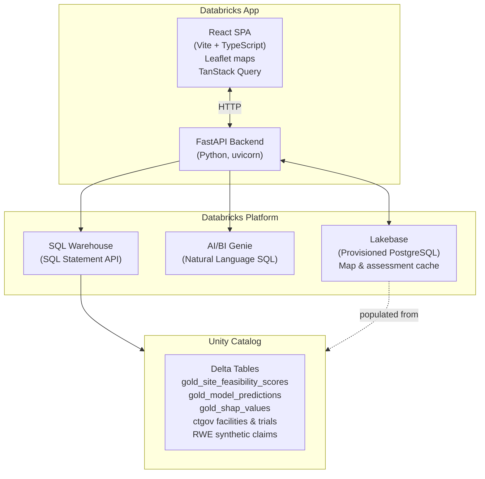

# Clinical Trial Site Feasibility Workbench

[](https://databricks.com)
[](https://docs.databricks.com/en/data-governance/unity-catalog/index.html)
[](https://docs.databricks.com/en/compute/serverless.html)

> **Databricks Solution Accelerator** — a starting point to accelerate clinical operations site selection on the Databricks platform. Use, extend, and adapt within the terms of the [DB License](LICENSE.md).

A Databricks App for clinical trial site selection and feasibility analysis. Helps clinical operations teams select, score, and shortlist investigator sites using ML-powered composite scoring, real-world evidence (RWE) patient access data, and an AI/BI Genie natural language interface — all running on a single Databricks workspace with no external dependencies.


## Installation Guidelines

**Steps 1–4 are the same for both deployment paths.**

1. Clone this repo locally
2. Upload and run `notebooks/00_seed_data.py` in your workspace — set the `catalog` widget to a catalog you own and click **Run All** (~3–5 min)
3. *(Optional)* Upload and run `notebooks/01_create_genie_space.py` with the same catalog to enable the AI/BI Genie chat assistant
4. Upload and run `notebooks/02_train_site_model.py` with the same catalog to train the ML stall risk model (~3–5 min)

**Then choose your deployment path** *(run these commands in a local terminal or the Databricks Web Terminal — they do not re-run the notebooks above):*

**Path A — CLI scripts** *(recommended for first-time setup — auto-detects everything)*
```bash
./setup.sh                              # writes app.yaml interactively (does not re-run notebooks)
databricks apps create public-site-workbench
./deploy.sh                             # builds frontend, syncs, deploys, grants UC permissions
```

**Path B — Databricks Asset Bundles** *(recommended if you are already familiar with DABs)*
```bash
./setup.sh                    # MUST run first — populates app.yaml with real values
databricks bundle deploy      # creates app resource + syncs files (including app.yaml) to workspace
databricks apps deploy public-site-workbench \
  --source-code-path /Workspace/Users/<your-username>/.bundle/public-site-workbench/dev/files
```
> Asset bundle deploy does **not** grant Unity Catalog permissions automatically — run the grants command in [Step 9B](#step-9b--grant-permissions) after deploying.

**Both paths:** if you enabled the Genie Space (Step 3), share it with the app service principal after deploy: **AI/BI → Genie → your space → Share → add SP with CAN USE**

> See the [Setup Guide](#setup-guide) below for full details, troubleshooting, and manual configuration options.

## Features

- **6-step feasibility wizard** — Protocol selection → constraints → geographic map → site ranking → deep dive → final shortlist
- **Composite site scoring** across 4 dimensions: RWE Patient Access (35%), Operational Performance (30%), Site Readiness & SSQ (20%), Protocol Execution (15%)
- **Interactive world map** of ClinicalTrials.gov active trial sites with indication filtering and RWE patient population overlay
- **Protocol-level site map** — your CTMS sites positioned by state centroid, with patient density and competitor trial overlay
- **Site deep dive** — feature contribution waterfall charts per scoring dimension with SHAP-driven explainability
- **AI/BI Genie assistant** — natural language SQL queries against all feasibility data (requires Genie Space setup)
- **Browse All Sites** — flat sortable/filterable table of all scored sites across all protocols with CSV export
- **Save/load assessments** — persist shortlists to Lakebase for team sharing
- **Export to CSV** — download your final site shortlist

## Architecture

<details>
<summary>Show architecture diagram</summary>



</details>

## Prerequisites

| Requirement | Notes |
|-------------|-------|
| Databricks workspace (AWS, Azure, or GCP) | Unity Catalog must be enabled |
| Databricks SQL Warehouse | Any size; serverless recommended |
| Databricks CLI 0.220+ | `pip install databricks-cli` or Homebrew |
| Python 3.10+ | Backend runtime |
| Node.js 18+ | Frontend build only |
| Lakebase (Provisioned PostgreSQL) | Optional — app falls back to direct SQL queries without it |
| AI/BI Genie Space | Optional — Feasibility Assistant chat returns 503 without it |

---

## Setup Guide

> **Time to deploy:** approximately 20–30 minutes end to end.

Steps 1–4 prepare your data and are identical for both deployment paths. Steps 2 and 4 (Lakebase) are optional — the app is fully functional without them. After Step 4, choose either:

- **[Path A — CLI scripts](#path-a--cli-scripts)** — `setup.sh` auto-detects your workspace settings and writes `app.yaml`; `deploy.sh` builds, syncs, deploys, and grants UC permissions in one command. Best for first-time setup.
- **[Path B — Asset Bundles](#path-b--asset-bundles)** — single `databricks bundle deploy` command with variables passed inline. Best if you are already familiar with Databricks Asset Bundles.

---

### Step 1 — Seed your Unity Catalog tables

Upload `notebooks/00_seed_data.py` to your Databricks workspace and run it as a notebook on any **single-node cluster** (DBR 13+, no extra libraries needed).

**How to upload:**
1. In your workspace, go to **Workspace → your home folder**
2. Click **+** → **Import** and select `notebooks/00_seed_data.py`

**How to run:**
1. Open the imported notebook
2. Set the `catalog` widget to **a catalog you own** (e.g. `my_catalog`). The notebook will fail if you leave the default value unchanged.
   > **Widget not visible?** The widget toolbar sometimes doesn't appear until after the first cell runs. If you don't see it, click **Run All** — the first cell will fail with a prompt to set the catalog. Set the catalog value in the widget that appears at the top of the notebook, then click **Run All** again from the beginning.
3. Attach to a single-node cluster and click **Run All**
4. The notebook takes 2–4 minutes and prints a row-count summary for all 10 tables when complete.

**Tables created:**

| Schema | Table | ~Rows | Description |
|--------|-------|-------|-------------|
| `clinicaltrials_gov` | `facilities` | ~900 | **Synthetic** — mimics AACT facilities; replace with real AACT data in production |
| `clinicaltrials_gov` | `conditions` | ~360 | **Synthetic** — mimics AACT conditions; replace with real AACT data in production |
| `ctgov_gold` | `trials` | ~360 | **Synthetic** trial metadata (status, phase, therapeutic area) |
| `ctms_data` | `ctms_site_geo` | 180 | **Synthetic** site geography (US state, ZIP3 centroid) |
| `ml_features` | `gold_site_feasibility_scores` | ~1,560 | **Synthetic** composite feasibility score per study × site |
| `ml_features` | `gold_model_predictions` | ~1,560 | **Synthetic** LightGBM enrollment velocity predictions |
| `ml_features` | `gold_shap_values` | ~7,800 | **Synthetic** SHAP feature attributions (top 5 drivers per study×site) |
| `ml_features` | `gold_feasibility_dimension_drivers` | ~18,700 | **Synthetic** per-dimension score with driver labels |
| `ml_features` | `gold_rwe_patient_access` | ~2,160 | **Synthetic** RWE estimated patient counts by site × indication |
| `dbx_marketplace_rwe_synthetic` | `claims_sample_synthetic` | ~2,000 | **Synthetic** claims records for patient-level queries |

> **All data is fully synthetic.** No real patients, investigators, sites, or trial results are represented. The `clinicaltrials_gov` schema name reflects the intended production schema — in a real deployment, replace those tables with data ingested from the [AACT database](https://aact.ctti-clinicaltrials.org/) (Aggregate Analysis of ClinicalTrials.gov), which provides a free PostgreSQL mirror of the full ClinicalTrials.gov dataset.

Note the catalog name — you'll use it as `UC_CATALOG` in the remaining steps.

> The seed notebook is fully idempotent. Re-running it drops and recreates all schemas and tables from scratch.

---

### Step 2 — Create the AI/BI Genie Space *(optional but recommended)*

The Feasibility Assistant chat tab requires a Genie Space connected to your Unity Catalog tables. Without it the tab returns a 503 error; all other app features work normally.

**Run the notebook:**
1. Import `notebooks/01_create_genie_space.py` into your workspace the same way as Step 1
2. Set the `catalog` widget to the same catalog used in Step 1
3. Leave `warehouse_id` blank — the notebook auto-detects a running warehouse
4. Click **Run All**. When complete it prints a `GENIE_SPACE_ID` — **copy this value** if you plan to configure `app.yaml` manually. If you use `setup.sh`, it finds the space automatically.

**Enable Databricks Assistant** *(workspace admin action, required once)*:

Go to **Settings → Workspace settings → Databricks Assistant** and toggle it on.

> Genie Space sharing with the app's service principal is a post-deploy step — the service principal is not created until the app is deployed. This is covered in Step 7A (CLI) or Step 9B (Asset Bundles).

---

### Step 3 — Train the ML stall risk model

Run `notebooks/02_train_site_model.py` to replace the placeholder gold table values with real ML-computed scores.

Import and run it the same way as Step 1 (same cluster, same catalog widget value). This notebook:
- Trains a per-therapeutic-area **GradientBoosting** classifier on the monthly enrollment time series generated in Step 1
- Runs inference to compute a **stall probability** for each site × study
- Computes **SHAP attributions** (top 5 feature drivers per site)
- Overwrites `gold_model_predictions`, `gold_shap_values`, `gold_site_feasibility_scores`, and `gold_feasibility_dimension_drivers` with genuine model output

> **Runtime:** 3–5 minutes. Requires `pip install shap` which happens automatically at the top of the notebook. The notebook is safe to re-run. Running it after the Genie Space is created is fine — Genie queries live Delta tables and will reflect the updated scores immediately.

Without this step the app is fully functional but the operational scores and SHAP driver charts will show seed-data placeholders rather than ML-computed values.

> If you re-run this notebook after the app is already deployed, **redeploy the app** afterwards to clear cached state and pick up the updated predictions.

---

### Step 4 — Create a Lakebase instance *(optional)*

Lakebase is a managed PostgreSQL instance the app uses to cache map data and persist saved shortlists. Without it the app queries Unity Catalog directly on every page load — slower on first visit, but fully functional.

1. Go to **Compute → Lakebase** in your workspace
2. Click **Create instance** and give it a name (e.g. `site-workbench-lakebase`)
3. Note the instance name — you'll use it in `app.yaml` in the next step

---

## Path A — CLI scripts

> **Where to run these commands:** Run them in any terminal with the [Databricks CLI](https://docs.databricks.com/en/dev-tools/cli/index.html) installed and authenticated. Common options:
> - Your **local terminal** (Mac/Linux/WSL) — install CLI via `pip install databricks-cli` or Homebrew
> - The **Databricks Web Terminal** — available from any running All Purpose cluster under **Compute → your cluster → Web Terminal**
> - A cloud shell (AWS CloudShell, Azure Cloud Shell, GCP Cloud Shell)

### Step 5A — Configure app.yaml

```bash
chmod +x setup.sh
./setup.sh
```

`setup.sh` **only writes `app.yaml`** — it does not run or re-run the notebooks from Steps 1–3. Those notebook steps are required first and are separate from the setup scripts.

`setup.sh` connects to your workspace and:
- Auto-detects your SQL Warehouse (selects the first running warehouse; prompts if multiple)
- Lists available Unity Catalog catalogs for you to choose from
- Auto-detects a matching Genie Space by name (if you ran Step 2)
- Prompts for your Lakebase instance name (optional)
- Writes a complete `app.yaml` and prints next-step commands

Use a custom CLI profile: `PROFILE=my-profile ./setup.sh`

**Manual alternative** — edit `app.yaml` directly if you prefer not to run `setup.sh`:

```yaml
env:
  - name: "DATABRICKS_WAREHOUSE_ID"
    value: "your-warehouse-id"     # SQL > SQL Warehouses > your warehouse > Connection details

  - name: "UC_CATALOG"
    value: "your-catalog-name"     # The catalog used in Step 1

  - name: "GENIE_SPACE_ID"
    value: "your-genie-space-id"   # Printed by 01_create_genie_space.py; leave blank to skip

  - name: "RWE_CLAIMS_TABLE"
    value: "your-catalog.dbx_marketplace_rwe_synthetic.claims_sample_synthetic"

# Optional: uncomment and fill in if using Lakebase (Step 4)
# resources:
#   - name: "your-lakebase-instance-name"
#     description: "Lakebase instance for caching map and patient data"
#     database:
#       instance_name: "your-lakebase-instance-name"
#       database_name: "databricks_postgres"
```

---

### Step 6A — Create and deploy the app

**First-time only — register the app:**

```bash
databricks apps create public-site-workbench --profile DEFAULT
```

**Deploy** (builds frontend, syncs files, deploys app, grants UC permissions automatically):

```bash
chmod +x deploy.sh
./deploy.sh
```

Custom profile or app name: `PROFILE=my-profile APP_NAME=my-app ./deploy.sh`

When complete, the script prints the app URL. You can also find it under **Apps** in your workspace.

---

### Step 7A — Grant Genie Space access *(only if you completed Step 2)*

Open the space under **AI/BI → Genie**, click **Share**, and add the app's service principal with **CAN USE**. Find the SP display name in the deploy script output or under **Apps → public-site-workbench → Permissions**.

> Unity Catalog permissions are granted automatically by `deploy.sh`. Only the Genie Space grant requires a manual step.

---

## Path B — Asset Bundles

> **Where to run these commands:** Same as Path A — any terminal with the Databricks CLI installed (local terminal, Databricks Web Terminal, or a cloud shell). See the note at the top of [Path A](#path-a--cli-scripts) for details.

### Step 5B — Build the frontend
### Step 5B — Configure app.yaml

The DAB deploy syncs your source files as-is — runtime configuration is read from `app.yaml`, not from `databricks.yml`. You must populate `app.yaml` before deploying.

**Option A — Automated (recommended):**
```bash
chmod +x setup.sh
./setup.sh
```

**Option B — Manual:** edit `app.yaml` directly (see the manual alternative in [Step 5A](#step-5a--configure-appyaml)).

---

### Step 6B — Build the frontend *(if Node.js is available)*

The pre-built `frontend/dist` is committed to the repo and used automatically if Node.js is not available. If you want a fresh build:

```bash
cd frontend && npm install && npm run build && cd ..
```

---

### Step 7B — Create app resource with `databricks bundle deploy`

> **Important:** `setup.sh` (Step 5B) must be completed and `app.yaml` must have real values before running this step. The bundle syncs `app.yaml` as-is — if it contains empty strings the app will fail to start with a format error.

```bash
databricks bundle deploy
```

With a custom profile or app name:
```bash
databricks bundle deploy --profile my-profile --var="app_name=my-app"
```

With a specific target:
```bash
databricks bundle deploy --target prod
```

`databricks bundle deploy` does two things: it creates the app resource in your workspace (equivalent to `databricks apps create`) and syncs your source files to `/Workspace/Users/<your-username>/.bundle/public-site-workbench/dev/files`. **It does not deploy the app** — that is a separate step below.

**To enable Lakebase** (if you created an instance in Step 4): uncomment and fill in the `resources:` block in `app.yaml` before running this step:

```yaml
resources:
  - name: "your-lakebase-instance-name"
    description: "Lakebase instance for caching map and patient data"
    database:
      instance_name: "your-lakebase-instance-name"
      database_name: "databricks_postgres"
```

---

### Step 8B — Deploy the app

After `bundle deploy` syncs your files, run `databricks apps deploy` pointing at the workspace path where the bundle placed them:

```bash
databricks apps deploy public-site-workbench \
  --source-code-path /Workspace/Users/<your-username>/.bundle/public-site-workbench/dev/files
```

With a custom profile:
```bash
databricks apps deploy public-site-workbench \
  --source-code-path /Workspace/Users/<your-username>/.bundle/public-site-workbench/dev/files \
  --profile my-profile
```

Replace `<your-username>` with your Databricks workspace username (e.g. `first.last@company.com`). You can find it by running:
```bash
databricks current-user me --output json | python3 -c "import sys,json; print(json.load(sys.stdin)['userName'])"
```

When the deploy completes, the app URL appears under **Apps** in your workspace.

> If you used a custom app name via `--var="app_name=my-app"` in Step 7B, substitute that name here instead of `public-site-workbench`.

---

### Step 9B — Grant permissions

Asset bundle deploy does not grant Unity Catalog permissions automatically. Run this after deploying.

**Get the SP client ID:**

```bash
databricks apps get public-site-workbench --profile DEFAULT --output json \
  | python3 -c "import sys,json; d=json.load(sys.stdin); print(d['service_principal_client_id'])"
```

Or find it under **Apps → public-site-workbench → Permissions** in the workspace UI.

**Grant Unity Catalog access:**

```bash
databricks grants update catalog <your-catalog> \
  --json '{
    "changes": [{
      "principal": "<sp-client-id>",
      "add": ["USE CATALOG", "USE SCHEMA", "SELECT"]
    }]
  }'
```

**Grant Genie Space access** *(only if you completed Step 2)*: open the space under **AI/BI → Genie**, click **Share**, and add the SP with **CAN USE**.

---

## Verify

Check the health endpoint:

```bash
curl https://<your-app-url>/health
# Expected: {"status": "ok", "lakebase_configured": true, "lakebase_ready": true}
```

| Field | Expected | Meaning |
|-------|----------|---------|
| `status` | `"ok"` | FastAPI backend is running |
| `lakebase_configured` | `true` | Lakebase instance name is set in app.yaml |
| `lakebase_ready` | `true` | Lakebase connected and tables populated |

If `lakebase_configured` is `false`, the `resources:` block is missing or the instance name doesn't match — the app will still work via direct SQL queries.

If `lakebase_ready` is `false`, the app started but failed to connect to Lakebase — check the instance name in `app.yaml` and review the app's compute logs under **Apps → public-site-workbench → Compute**.

---

## Troubleshooting

### App reloads or shows a blank page on every tab switch

**This is expected behavior.** Databricks Apps suspend after approximately 10 minutes of inactivity to save compute. The next request after a suspension triggers a cold start (15–30 seconds). This is a platform behavior, not a bug.

To keep the app warm during a demo, leave the browser tab open and active.

---

### `INSUFFICIENT_PERMISSIONS` errors when the app opens

The app's service principal does not have access to your Unity Catalog tables. Follow the Unity Catalog grant in **Step 6A** (CLI) or **Step 9B** (Asset Bundles) above.

To confirm which principal needs access: **Apps → public-site-workbench → Permissions** in the workspace UI.

---

### Feasibility Assistant chat tab shows a 503 error

`GENIE_SPACE_ID` is not set or is invalid in `app.yaml`. Run `notebooks/01_create_genie_space.py`, then either re-run `./setup.sh` (which auto-detects the space) or manually add the printed space ID to `app.yaml`, then redeploy:

```bash
./deploy.sh
```

---

### Feasibility Assistant shows "Genie unavailable" (not 503)

Two separate conditions must both be true — a valid `GENIE_SPACE_ID` alone is not sufficient:

**1. Databricks Assistant must be enabled workspace-wide.**
Go to **Settings → Workspace settings → Databricks Assistant** and toggle it on.

**2. The app service principal must have CAN USE on the Genie Space.**
Open the space under **AI/BI → Genie**, click **Share**, and add the app's service principal (found under **Apps → your-app → Permissions**) with at least **CAN USE**.

---

### Patient population overlay on the world map shows no dots

The RWE patient overlay shows US sites only. If the overlay is empty:

1. Confirm the seed notebook ran successfully and `gold_rwe_patient_access` exists in your catalog
2. Confirm `RWE_CLAIMS_TABLE` is set correctly in `app.yaml`
3. If Lakebase is configured, **redeploy the app** after re-seeding — Lakebase is populated at startup and does not refresh automatically when the underlying Delta tables change

---

### World map shows no sites at all

1. Confirm `clinicaltrials_gov.facilities` was created by the seed notebook
2. Confirm the app's service principal has SELECT on the `clinicaltrials_gov` schema (Step 6)

---

### Protocol map (wizard Step 3) shows no US site markers

Site markers use `ctms_data.ctms_site_geo` for coordinates. Re-run `00_seed_data.py` if this table is missing or empty.

---

### `databricks apps deploy` fails with "App does not exist"

Create the app first:

```bash
databricks apps create public-site-workbench --profile DEFAULT
```

Then re-run the deploy.

---

### Shortlist page shows `—` for Pred/month on all sites

The `predicted_next_month_rands` column in `ml_features.gold_model_predictions` is not joining to `ml_features.gold_site_feasibility_scores`. Diagnose with:

```python
catalog = "<your-catalog>"
spark.sql(f"""
  SELECT COUNT(*) AS joined_rows
  FROM {catalog}.ml_features.gold_site_feasibility_scores s
  JOIN {catalog}.ml_features.gold_model_predictions p
    ON s.site_id = p.site_id AND s.study_id = p.study_id AND p.is_latest = 1
""").display()

# Verify site_id values look like SITE_001 (not study IDs like CDISCPILOT01)
spark.sql(f"SELECT site_id, study_id, predicted_next_month_rands FROM {catalog}.ml_features.gold_model_predictions LIMIT 5").display()
```

If `joined_rows = 0` and `site_id` contains study ID values (e.g. `CDISCPILOT01`): the old version of `02_train_site_model.py` was run. Download the latest notebook from the repo, re-upload it to your workspace, and re-run it. After it completes, **redeploy the app** — the app caches query results at startup and won't reflect the updated table without a fresh deployment.

---

### Lakebase data is stale after re-running the seed notebook

Lakebase is populated once at app startup. If you re-run the seed notebook, **redeploy the app** to force a fresh startup:

```bash
./deploy.sh
```

---

### Site scoring dimension contributions show values over 100%

Re-run `00_seed_data.py`. An earlier version stored contribution percentages as 0–100 instead of the 0–1 decimals the frontend expects. The current notebook is correct, and re-running is safe — it is fully idempotent.

---

## Local Development

```bash
# 1. Install backend dependencies
python -m venv .venv
source .venv/bin/activate
pip install -e ".[dev]"

# 2. Configure environment
cp .env.example .env
# Edit .env and fill in DATABRICKS_WAREHOUSE_ID, UC_CATALOG, etc.

# 3. Start backend
uvicorn app:app --reload --port 8000

# 4. Start frontend (separate terminal)
cd frontend
npm install
npm run dev   # Vite proxy forwards /api/* to localhost:8000
```

The app will be available at `http://localhost:5173`. Databricks auth uses your local CLI profile (`~/.databrickscfg`).

---

## Configuration Reference

| Variable | Required | Description |
|----------|----------|-------------|
| `DATABRICKS_WAREHOUSE_ID` | Yes | SQL Warehouse ID (find in SQL > SQL Warehouses > Connection details) |
| `UC_CATALOG` | Yes | Unity Catalog name where your seed tables live |
| `GENIE_SPACE_ID` | No | AI/BI Genie Space ID — run `notebooks/01_create_genie_space.py` to generate |
| `RWE_CLAIMS_TABLE` | No | Fully-qualified claims table (defaults to `<UC_CATALOG>.dbx_marketplace_rwe_synthetic.claims_sample_synthetic`) |
| `DATABRICKS_PROFILE` | Local only | Databricks CLI profile for local dev (default: `DEFAULT`) |

---

## Project Structure

```
public-site-workbench/
├── app.py                    # FastAPI entry point + /health endpoint
├── app.yaml                  # Databricks Apps config — populated by setup.sh or edited manually
├── setup.sh                  # Auto-detects warehouse, catalog, Genie Space and writes app.yaml
├── deploy.sh                 # One-command build + sync + deploy script
├── pyproject.toml            # Python dependencies
├── .env.example              # Environment variable template for local dev
├── notebooks/
│   ├── 00_seed_data.py           # Creates all 10 Unity Catalog tables (run first)
│   ├── 01_create_genie_space.py  # Creates AI/BI Genie Space (run second, optional)
│   └── 02_train_site_model.py    # Trains ML stall risk model, refreshes gold tables (run third)
├── server/
│   ├── config.py             # Workspace client, TABLES dict, env var resolution
│   ├── db.py                 # Lakebase (asyncpg) connection pool
│   ├── lakebase_init.py      # Startup: populates Lakebase cache from Unity Catalog
│   └── routes/
│       ├── assessments.py    # Save/load feasibility assessments
│       ├── chat.py           # Feasibility Assistant (Genie chat)
│       ├── feasibility.py    # Site feasibility score endpoints
│       ├── indications.py    # Indication list
│       ├── map_data.py       # World map trial site data
│       ├── patient_data.py   # RWE patient population data
│       └── protocols.py      # Protocol metadata + site scoring
└── frontend/
    ├── src/
    │   ├── App.tsx
    │   ├── pages/
    │   │   ├── WizardApp.tsx        # 6-step wizard shell
    │   │   └── FeasibilityView.tsx  # Browse All Sites flat table
    │   └── components/
    │       ├── FeasibilityAssistant.tsx  # Genie chat sidebar
    │       ├── TrialMap.tsx              # World map (react-leaflet)
    │       └── wizard/
    │           ├── Step1Protocol.tsx     # Protocol selection
    │           ├── Step2Constraints.tsx  # Score threshold filters
    │           ├── Step3Map.tsx          # Protocol-level map
    │           ├── Step4Ranking.tsx      # Site ranking table
    │           ├── Step5DeepDive.tsx     # Site driver deep dive
    │           └── Step6Shortlist.tsx    # Final shortlist + export
    └── dist/                 # Pre-built frontend (committed — no build step needed to deploy)
```

---

## Libraries

### Python backend

| Library | Version | License |
|---------|---------|---------|
| [FastAPI](https://pypi.org/project/fastapi/) | ≥0.115.0 | MIT |
| [uvicorn](https://pypi.org/project/uvicorn/) | ≥0.30.0 | BSD-3-Clause |
| [databricks-sdk](https://pypi.org/project/databricks-sdk/) | ≥0.30.0 | Apache-2.0 |
| [asyncpg](https://pypi.org/project/asyncpg/) | ≥0.30.0 | Apache-2.0 |

### Frontend

| Package | Version | License |
|---------|---------|---------|
| [react](https://www.npmjs.com/package/react) | ^18.3.1 | MIT |
| [react-leaflet](https://www.npmjs.com/package/react-leaflet) | ^4.2.1 | BSD-2-Clause |
| [@tanstack/react-query](https://www.npmjs.com/package/@tanstack/react-query) | ^5.59.0 | MIT |
| [lucide-react](https://www.npmjs.com/package/lucide-react) | ^0.453.0 | ISC |
| [tailwindcss](https://www.npmjs.com/package/tailwindcss) | ^3.4.14 | MIT |
| [vite](https://www.npmjs.com/package/vite) | ^6.0.0 | MIT |

---

## License

See [LICENSE.md](LICENSE.md).

## Contributing

See [CONTRIBUTING.md](CONTRIBUTING.md).

## Support

Databricks does not offer official support for this accelerator. Open a GitHub issue and the team will respond on a best-effort basis. See [NOTICE.md](NOTICE.md).
