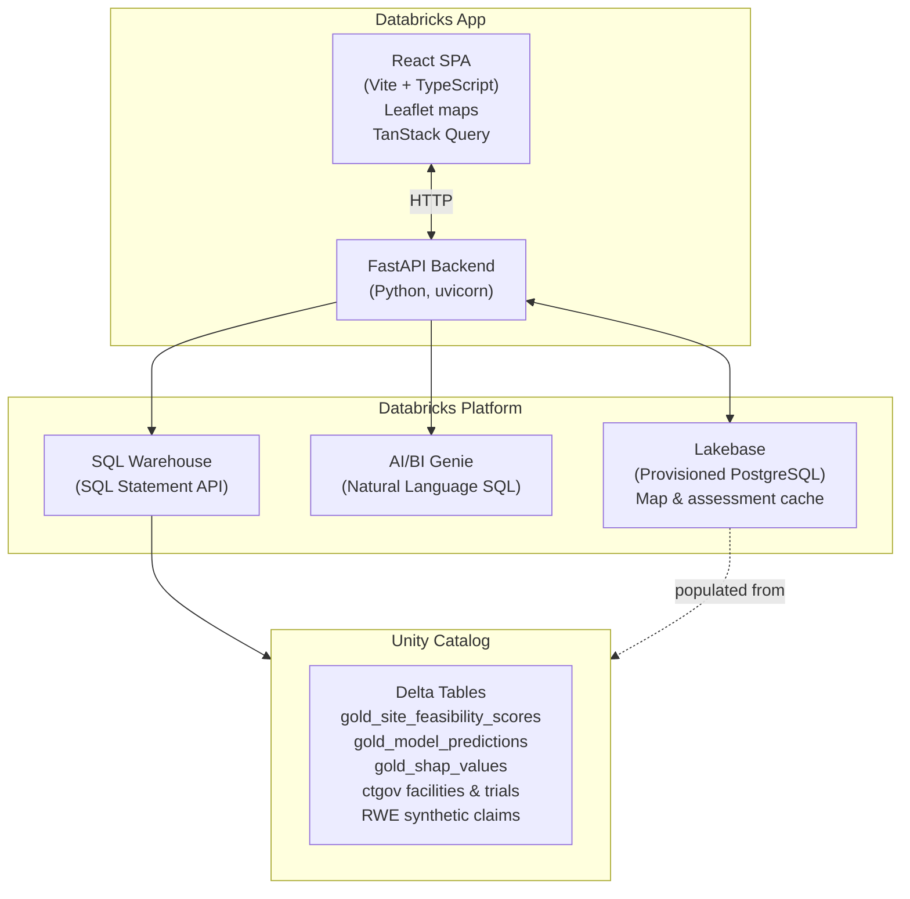

# Clinical Trial Site Feasibility Workbench

> **Databricks Solution Accelerator** — a starting point to accelerate clinical operations site selection on the Databricks platform. Use, extend, and adapt within the terms of the [DB License](LICENSE.md).

A Databricks App for clinical trial site selection and feasibility analysis. Helps clinical operations teams select, score, and shortlist investigator sites using ML-powered composite scoring, real-world evidence (RWE) patient access data, and an AI/BI Genie natural language interface — all running on a single Databricks workspace with no external dependencies.


## Features

- **6-step feasibility wizard** — Protocol selection → constraints → geographic map → site ranking → deep dive → final shortlist
- **Composite site scoring** across 4 dimensions: RWE Patient Access (35%), Operational Performance (30%), Site Readiness & SSQ (20%), Protocol Execution (15%)
- **Interactive world map** of ClinicalTrials.gov active trial sites with indication filtering and RWE patient population overlay
- **Protocol-level site map** — your CTMS sites positioned by state centroid, with patient density and competitor trial overlay
- **Site deep dive** — feature contribution waterfall charts per scoring dimension with SHAP-driven explainability
- **AI/BI Genie assistant** — natural language SQL queries against all feasibility data (requires Genie Space setup)
- **Browse All Sites** — flat sortable/filterable table of all scored sites across all protocols with CSV export
- **Save/load assessments** — persist shortlists to Lakebase for team sharing
- **Export to CSV** — download your final site shortlist

## Architecture

<details>
<summary>Show architecture diagram</summary>



</details>

## Prerequisites

| Requirement | Notes |
|-------------|-------|
| Databricks workspace (AWS, Azure, or GCP) | Unity Catalog must be enabled |
| Databricks SQL Warehouse | Any size; serverless recommended |
| Databricks CLI 0.220+ | `pip install databricks-cli` or Homebrew |
| Python 3.10+ | Backend runtime |
| Node.js 18+ | Frontend build only |
| Lakebase (Provisioned PostgreSQL) | Optional — app falls back to direct SQL queries without it |
| AI/BI Genie Space | Optional — Feasibility Assistant chat returns 503 without it |

---

## Setup Guide

> **Time to deploy:** approximately 20–30 minutes end to end.

Steps 1, 4, 5, and 6 are required. Steps 2 and 3 add the Genie chat assistant and Lakebase caching respectively — the app is fully functional without them.

> **Tip:** `setup.sh` automates Step 4 — it detects your warehouse, lists your catalogs, finds your Genie Space, and writes `app.yaml` for you. Run it after completing Steps 1–3. Use `PROFILE=my-profile ./setup.sh` if you are not on the `DEFAULT` CLI profile.

---

### Step 1 — Seed your Unity Catalog tables

Upload `notebooks/00_seed_data.py` to your Databricks workspace and run it as a notebook on any **single-node cluster** (DBR 13+, no extra libraries needed).

**How to upload:**
1. In your workspace, go to **Workspace → your home folder**
2. Click **+** → **Import** and select `notebooks/00_seed_data.py`

**How to run:**
1. Open the imported notebook
2. Set the `catalog` widget to **a catalog you own** (e.g. `my_catalog`). The notebook will fail if you leave the default value unchanged.
3. Attach to a single-node cluster and click **Run All**
4. The notebook takes 2–4 minutes and prints a row-count summary for all 10 tables when complete.

**Tables created:**

| Schema | Table | ~Rows | Description |
|--------|-------|-------|-------------|
| `clinicaltrials_gov` | `facilities` | ~900 | Active trial sites worldwide (nct_id, city, country) |
| `clinicaltrials_gov` | `conditions` | ~360 | Indications linked to each trial |
| `ctgov_gold` | `trials` | ~360 | Trial status, phase, therapeutic area |
| `ctms_data` | `ctms_site_geo` | 180 | Site geography (US state, ZIP3 centroid) |
| `ml_features` | `gold_site_feasibility_scores` | ~1,560 | Composite feasibility score per study × site (~100 sites per protocol) |
| `ml_features` | `gold_model_predictions` | ~1,560 | LightGBM enrollment velocity predictions |
| `ml_features` | `gold_shap_values` | ~7,800 | SHAP feature attributions (top 5 drivers per study×site) |
| `ml_features` | `gold_feasibility_dimension_drivers` | ~18,700 | Per-dimension score with driver labels |
| `ml_features` | `gold_rwe_patient_access` | ~2,160 | RWE estimated patient counts by site × indication |
| `dbx_marketplace_rwe_synthetic` | `claims_sample_synthetic` | ~2,000 | Synthetic claims records for patient-level queries |

Note the catalog name — you'll use it as `UC_CATALOG` in the remaining steps.

> The seed notebook is fully idempotent. Re-running it drops and recreates all schemas and tables from scratch.

---

### Step 2 — Create the AI/BI Genie Space *(optional but recommended)*

The Feasibility Assistant chat tab requires a Genie Space connected to your Unity Catalog tables. Without it the tab returns a 503 error; all other app features work normally.

**Run the notebook:**
1. Import `notebooks/01_create_genie_space.py` into your workspace the same way as Step 1
2. Set the `catalog` widget to the same catalog used in Step 1
3. Leave `warehouse_id` blank — the notebook auto-detects a running warehouse
4. Click **Run All**. When complete it prints a `GENIE_SPACE_ID` — **copy this value** if you plan to configure `app.yaml` manually (Step 4, Option B). If you use `setup.sh`, it finds the space automatically.

**Enable Databricks Assistant** *(workspace admin action, required once)*:

Go to **Settings → Workspace settings → Databricks Assistant** and toggle it on.

> Genie Space sharing with the app's service principal is a post-deploy step — the service principal is not created until the app is deployed (Step 5). This is covered in Step 6.

---

### Step 3 — Create a Lakebase instance *(optional)*

Lakebase is a managed PostgreSQL instance the app uses to cache map data and persist saved shortlists. Without it the app queries Unity Catalog directly on every page load — slower on first visit, but fully functional.

1. Go to **Compute → Lakebase** in your workspace
2. Click **Create instance** and give it a name (e.g. `site-workbench-lakebase`)
3. Note the instance name — you'll use it in `app.yaml` in the next step

---

### Step 4 — Configure app.yaml

**Option A — Automated (recommended):**

```bash
chmod +x setup.sh
./setup.sh
```

`setup.sh` connects to your workspace and:
- Auto-detects your SQL Warehouse (selects the first running warehouse; prompts if multiple)
- Lists available Unity Catalog catalogs for you to choose from
- Auto-detects a matching Genie Space by name (if you ran Step 2)
- Prompts for your Lakebase instance name (optional)
- Writes a complete `app.yaml` and prints the next-step commands

**Option B — Manual:**

Edit `app.yaml` directly:

```yaml
env:
  - name: "DATABRICKS_WAREHOUSE_ID"
    value: "your-warehouse-id"          # SQL > SQL Warehouses > your warehouse > Connection details

  - name: "UC_CATALOG"
    value: "your-catalog-name"          # The catalog used in Step 1

  - name: "GENIE_SPACE_ID"
    value: "your-genie-space-id"        # Printed by 01_create_genie_space.py; leave blank to skip

  - name: "RWE_CLAIMS_TABLE"
    value: "your-catalog.dbx_marketplace_rwe_synthetic.claims_sample_synthetic"

# Lakebase (optional — add this block if you created an instance in Step 3):
# resources:
#   - name: "your-lakebase-instance-name"
#     description: "Lakebase instance for caching map and patient data"
#     database:
#       instance_name: "your-lakebase-instance-name"
#       database_name: "databricks_postgres"
```

**Finding your SQL Warehouse ID:** go to **SQL → SQL Warehouses**, click your warehouse, then **Connection details** — the ID is the alphanumeric string in the HTTP path.

**To enable Lakebase:** uncomment the `resources:` block and replace the placeholder name with your instance name from Step 3.

---

### Step 5 — Create and deploy the app

**First-time only — register the app in your workspace:**

```bash
databricks apps create public-site-workbench --profile DEFAULT
```

**Deploy:**

```bash
chmod +x deploy.sh
./deploy.sh
```

The deploy script builds the React frontend, syncs source files to your workspace, and deploys the Databricks App. When complete, the CLI prints the app URL. You can also find it under **Apps** in your workspace.

**Custom CLI profile or app name:**

```bash
PROFILE=my-profile APP_NAME=my-app ./deploy.sh
```

---

### Step 6 — Grant permissions

The app runs as a dedicated service principal with its own identity. Two permission grants are required after the app is deployed.

**Find your app's service principal:**

```bash
databricks apps get public-site-workbench --profile DEFAULT --output json \
  | python3 -c "import sys,json; d=json.load(sys.stdin); print('SP name:', d['service_principal_name'])"
```

Or find it in the workspace UI: **Apps → public-site-workbench → Permissions**.

**Grant Unity Catalog access** (replace `<sp-name>` with the service principal name from above):

```bash
databricks grants update catalog your-catalog-name \
  --json '{
    "changes": [{
      "principal": "<sp-name>",
      "add": ["USE CATALOG", "USE SCHEMA", "SELECT"]
    }]
  }'
```

You can also do this through the UI: **Catalog Explorer → your catalog → Permissions → Grant**.

**Grant Genie Space access** *(only needed if you completed Step 2)*:

The Genie Space is private to its creator by default. Open the space under **AI/BI → Genie**, click **Share**, and add the app's service principal with **CAN USE**.

> The service principal name is the same in both grants — find it with the CLI command above or under **Apps → public-site-workbench → Permissions** in the UI.

---

### Step 7 — Verify

Check the health endpoint:

```bash
curl https://<your-app-url>/health
# Expected: {"status": "ok", "lakebase_configured": true, "lakebase_ready": true}
```

| Field | Expected | Meaning |
|-------|----------|---------|
| `status` | `"ok"` | FastAPI backend is running |
| `lakebase_configured` | `true` | Lakebase instance name is set in app.yaml |
| `lakebase_ready` | `true` | Lakebase connected and tables populated |

If `lakebase_configured` is `false`, the `resources:` block is missing or the instance name doesn't match — the app will still work via direct SQL queries.

If `lakebase_ready` is `false`, the app started but failed to connect to Lakebase — check the instance name in `app.yaml` and review the app's compute logs under **Apps → public-site-workbench → Compute**.

---

## Troubleshooting

### App reloads or shows a blank page on every tab switch

**This is expected behavior.** Databricks Apps suspend after approximately 10 minutes of inactivity to save compute. The next request after a suspension triggers a cold start (15–30 seconds). This is a platform behavior, not a bug.

To keep the app warm during a demo, leave the browser tab open and active.

---

### `INSUFFICIENT_PERMISSIONS` errors when the app opens

The app's service principal does not have access to your Unity Catalog tables. Follow the Unity Catalog grant in **Step 6** above.

To confirm which principal needs access: **Apps → public-site-workbench → Permissions** in the workspace UI.

---

### Feasibility Assistant chat tab shows a 503 error

`GENIE_SPACE_ID` is not set or is invalid in `app.yaml`. Run `notebooks/01_create_genie_space.py`, then either re-run `./setup.sh` (which auto-detects the space) or manually add the printed space ID to `app.yaml`, then redeploy:

```bash
./deploy.sh
```

---

### Feasibility Assistant shows "Genie unavailable" (not 503)

Two separate conditions must both be true — a valid `GENIE_SPACE_ID` alone is not sufficient:

**1. Databricks Assistant must be enabled workspace-wide.**
Go to **Settings → Workspace settings → Databricks Assistant** and toggle it on.

**2. The app service principal must have CAN USE on the Genie Space.**
Open the space under **AI/BI → Genie**, click **Share**, and add the app's service principal (found under **Apps → your-app → Permissions**) with at least **CAN USE**.

---

### Patient population overlay on the world map shows no dots

The RWE patient overlay shows US sites only. If the overlay is empty:

1. Confirm the seed notebook ran successfully and `gold_rwe_patient_access` exists in your catalog
2. Confirm `RWE_CLAIMS_TABLE` is set correctly in `app.yaml`
3. If Lakebase is configured, **redeploy the app** after re-seeding — Lakebase is populated at startup and does not refresh automatically when the underlying Delta tables change

---

### World map shows no sites at all

1. Confirm `clinicaltrials_gov.facilities` was created by the seed notebook
2. Confirm the app's service principal has SELECT on the `clinicaltrials_gov` schema (Step 6)

---

### Protocol map (wizard Step 3) shows no US site markers

Site markers use `ctms_data.ctms_site_geo` for coordinates. Re-run `00_seed_data.py` if this table is missing or empty.

---

### `databricks apps deploy` fails with "App does not exist"

Create the app first:

```bash
databricks apps create public-site-workbench --profile DEFAULT
```

Then re-run the deploy.

---

### Lakebase data is stale after re-running the seed notebook

Lakebase is populated once at app startup. If you re-run the seed notebook, **redeploy the app** to force a fresh startup:

```bash
./deploy.sh
```

---

### Site scoring dimension contributions show values over 100%

Re-run `00_seed_data.py`. An earlier version stored contribution percentages as 0–100 instead of the 0–1 decimals the frontend expects. The current notebook is correct, and re-running is safe — it is fully idempotent.

---

## Local Development

```bash
# 1. Install backend dependencies
python -m venv .venv
source .venv/bin/activate
pip install -e ".[dev]"

# 2. Configure environment
cp .env.example .env
# Edit .env and fill in DATABRICKS_WAREHOUSE_ID, UC_CATALOG, etc.

# 3. Start backend
uvicorn app:app --reload --port 8000

# 4. Start frontend (separate terminal)
cd frontend
npm install
npm run dev   # Vite proxy forwards /api/* to localhost:8000
```

The app will be available at `http://localhost:5173`. Databricks auth uses your local CLI profile (`~/.databrickscfg`).

---

## Configuration Reference

| Variable | Required | Description |
|----------|----------|-------------|
| `DATABRICKS_WAREHOUSE_ID` | Yes | SQL Warehouse ID (find in SQL > SQL Warehouses > Connection details) |
| `UC_CATALOG` | Yes | Unity Catalog name where your seed tables live |
| `GENIE_SPACE_ID` | No | AI/BI Genie Space ID — run `notebooks/01_create_genie_space.py` to generate |
| `RWE_CLAIMS_TABLE` | No | Fully-qualified claims table (defaults to `<UC_CATALOG>.dbx_marketplace_rwe_synthetic.claims_sample_synthetic`) |
| `DATABRICKS_PROFILE` | Local only | Databricks CLI profile for local dev (default: `DEFAULT`) |

---

## Project Structure

```
public-site-workbench/
├── app.py                    # FastAPI entry point + /health endpoint
├── app.yaml                  # Databricks Apps config — populated by setup.sh or edited manually
├── setup.sh                  # Auto-detects warehouse, catalog, Genie Space and writes app.yaml
├── deploy.sh                 # One-command build + sync + deploy script
├── pyproject.toml            # Python dependencies
├── .env.example              # Environment variable template for local dev
├── notebooks/
│   ├── 00_seed_data.py       # Creates all 10 Unity Catalog tables (run first)
│   └── 01_create_genie_space.py  # Creates AI/BI Genie Space (run second, optional)
├── server/
│   ├── config.py             # Workspace client, TABLES dict, env var resolution
│   ├── db.py                 # Lakebase (asyncpg) connection pool
│   ├── lakebase_init.py      # Startup: populates Lakebase cache from Unity Catalog
│   └── routes/
│       ├── assessments.py    # Save/load feasibility assessments
│       ├── chat.py           # Feasibility Assistant (Genie chat)
│       ├── feasibility.py    # Site feasibility score endpoints
│       ├── indications.py    # Indication list
│       ├── map_data.py       # World map trial site data
│       ├── patient_data.py   # RWE patient population data
│       └── protocols.py      # Protocol metadata + site scoring
└── frontend/
    ├── src/
    │   ├── App.tsx
    │   ├── pages/
    │   │   ├── WizardApp.tsx        # 6-step wizard shell
    │   │   └── FeasibilityView.tsx  # Browse All Sites flat table
    │   └── components/
    │       ├── FeasibilityAssistant.tsx  # Genie chat sidebar
    │       ├── TrialMap.tsx              # World map (react-leaflet)
    │       └── wizard/
    │           ├── Step1Protocol.tsx     # Protocol selection
    │           ├── Step2Constraints.tsx  # Score threshold filters
    │           ├── Step3Map.tsx          # Protocol-level map
    │           ├── Step4Ranking.tsx      # Site ranking table
    │           ├── Step5DeepDive.tsx     # Site driver deep dive
    │           └── Step6Shortlist.tsx    # Final shortlist + export
    └── dist/                 # Pre-built frontend (committed — no build step needed to deploy)
```

---

## Libraries

### Python backend

| Library | Version | License |
|---------|---------|---------|
| [FastAPI](https://pypi.org/project/fastapi/) | ≥0.115.0 | MIT |
| [uvicorn](https://pypi.org/project/uvicorn/) | ≥0.30.0 | BSD-3-Clause |
| [databricks-sdk](https://pypi.org/project/databricks-sdk/) | ≥0.30.0 | Apache-2.0 |
| [asyncpg](https://pypi.org/project/asyncpg/) | ≥0.29.0 | Apache-2.0 |

### Frontend

| Package | Version | License |
|---------|---------|---------|
| [react](https://www.npmjs.com/package/react) | ^18.3.1 | MIT |
| [react-leaflet](https://www.npmjs.com/package/react-leaflet) | ^4.2.1 | Hippocratic-2.1 |
| [@tanstack/react-query](https://www.npmjs.com/package/@tanstack/react-query) | ^5.59.0 | MIT |
| [lucide-react](https://www.npmjs.com/package/lucide-react) | ^0.453.0 | ISC |
| [tailwindcss](https://www.npmjs.com/package/tailwindcss) | ^3.4.14 | MIT |
| [vite](https://www.npmjs.com/package/vite) | ^6.0.0 | MIT |

---

## License

See [LICENSE.md](LICENSE.md).

## Contributing

See [CONTRIBUTING.md](CONTRIBUTING.md).

## Support

Databricks does not offer official support for this accelerator. Open a GitHub issue and the team will respond on a best-effort basis. See [NOTICE.md](NOTICE.md).
